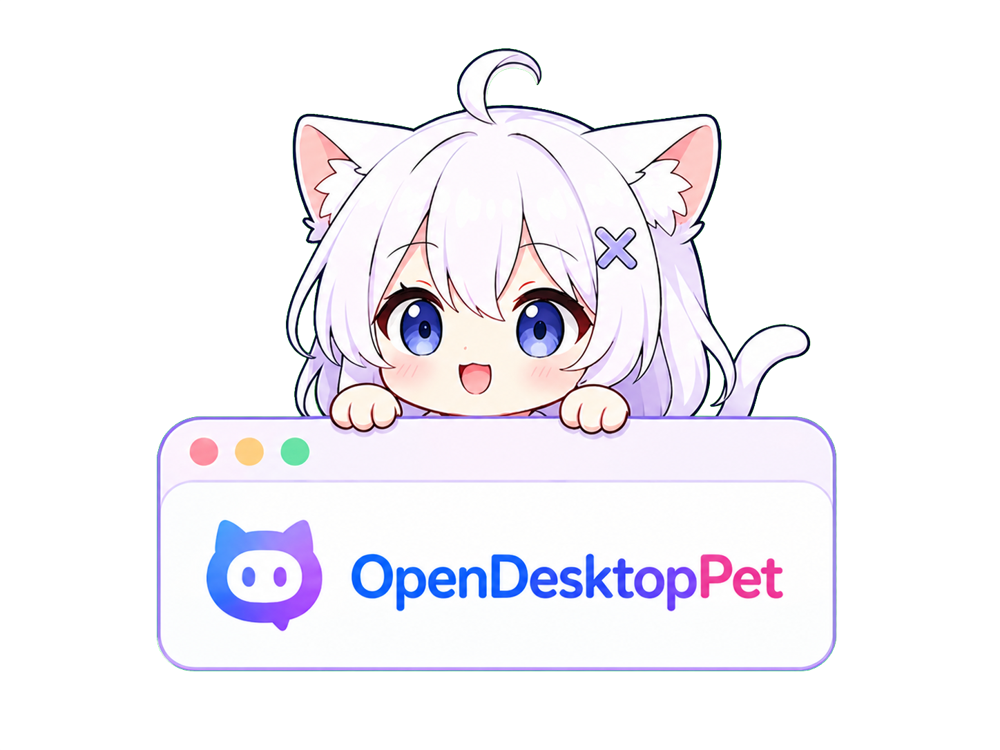
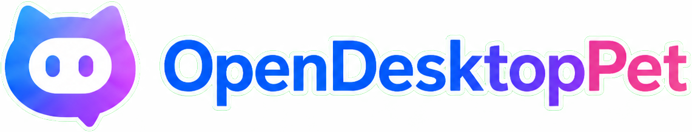

<p align="center">
  
</p>

<p align="center">
  
</p>

<h1 align="center">OpenDesktopPet</h1>

<p align="center">
  一个基于 Electron + Live2D 的 AI 桌面宠物，支持语音合成、实时截屏感知、摄像头视觉、长期记忆和主动互动。
</p>

<p align="center">
  <a href="LICENSE"></a>
  
  
</p>

---

## 功能特性

### 桌宠形象

- **Live2D 角色**：窗口透明无边框，桌宠悬浮在桌面上，支持丰富表情和动作
- **自定义图片角色**：支持上传 PNG/GIF/WebP/SVG 等图片替代 Live2D 模型，透明底图片无白边
- **交互反馈**：点击桌宠不同身体部位（头部、眼睛、嘴巴、身体���）触发不同表情和动作
- **窗口缩放**：支持滚轮缩放和按钮缩放（0.6x ~ 1.8x），位置可自由拖拽

### AI 对话

- **多模型支持**：接入豆包大模型，支持任意 OpenAI 兼容接口（OpenAI、DeepSeek、Ollama 等）
- **流式输出**：实时逐字显示 AI 回复
- **气泡消息**：回复以浮动气泡展示在桌宠旁边，气泡位置和大小可自由调整
- **AI 开关**：一���开启/关闭 AI 交互功能

### 语音合成（TTS）

支持四种语音引擎，开箱即用：

| 引擎 | 说明 | 需要 Key |
|---|---|---|
| **火山引擎** | 高质量中文语音 | 是 |
| **Edge TTS** | 微软免费语音 | 否 |
| **OpenAI TTS** | OpenAI / 兼容接口 | 是 |
| **CosyVoice** | 本地部署 HTTP TTS | 否 |

- **口型同步**：基于 Web Audio API AnalyserNode 实时检测音频音量，驱动 Live2D 嘴型动画

### 屏幕感知

- **截屏对话**：手动截取当前屏幕发给 AI，让桌宠"看见"你在做什么
- **对话附带截屏**：可配置每次对话时自动附带屏幕截图

### 摄像头视觉

- **摄像头接入**：支持调用摄像头采集实时画面，让桌宠"看到"你
- **设备选择**：支持多摄像头切换，设置面板内可实时预览
- **灵活触发**：可分别配置在主动互动 / 用户对话时是否附带摄像头画面

### 主动互动

- **定时触发**：桌宠自动截屏观察用户状态，结合摄像头画面，通过 AI 决策是否打招呼
- **智能决策**：通过 function call 判断用户是否正在专注工作，避免不必要的打扰
- **随机间隔**：支持设置最小/最大触发间隔，行为更自然
- **自定义提示词**：决策提示词和发言提示词均可自定义

### 长期记忆

- **三层记忆系统**：短期上下文 + 长期摘要 + 结构化事实
- **自动压缩**：对话积累到阈值时自动调用 LLM 进行摘要压缩和事实提取
- **跨会话持久化**：记忆存储在本地 `memory.json`，重启后仍然记得你
- **记忆管理**：支持导出、导入、清空记忆

### 个性化设置

- **独立设置窗口**：完整的图形化设置面板，所有配置均可在界面内修改
- **主题色**：支持纯色和渐变双色模式，多种预设主题可选
- **字体/工具栏大小**：可调节界面字体大小和底部工具栏高度
- **提示词导入/导出**：支持导入导出 system prompt 等提示词配置

### 开发调试

- **提示词调试器**：独立窗口实时查看每次发给模型的完整消息列表，支持单条复制和折叠

---

## 目录结构

```
desktop-pet/
├── main.js              # Electron 主进程
├── preload.js           # 预加载脚本（IPC 桥接）
├── start.js             # 启动入口（electron 命令包装）
├── config.example.json  # 配置模板（复制为 config.json 后填写 Key）
├── memory.example.json  # 空记忆模板
├── renderer/
│   ├── index.html       # 主界面（Live2D + 聊天 + 气泡）
│   ├── chat.js          # 聊天逻辑、TTS 音频播放、口型同步
│   ├── pet-controller.js# Live2D / 图片模式控制、交互检测
│   ├── settings.html    # 独立设置窗口
│   ├── settings.js      # 设置窗口逻辑
│   └── debug.html       # 提示词调试器窗口
├── services/
│   ├── llm-service.js   # LLM 流式请求封装
│   ├── tts-service.js   # 多引擎 TTS 封装
│   └── memory-service.js# 记忆管理（短期上下文 + 摘要 + 事实提取）
├── libs/                # Live2D 运行时库
├── assets/              # Live2D 模型资源
└── icon/                # 托盘图标
```

---

## 快速开始

### 环境要求

- Node.js >= 18
- Windows 或 macOS

### 安装依赖

```bash
npm install
```

### 启动

```bash
# Windows
npm start

# macOS
npm run start:mac
```

---

## 打包

### Windows

```bash
# 安装包（NSIS）
npm run build

# 便携版 exe
npm run build:portable
```

### macOS（需在 Mac 上执行）

```bash
# 通用包（Intel + Apple Silicon 均可运行）
npm run build:mac

# 仅 Apple Silicon (M 系列)
npm run build:mac-arm
```

打包产物均在 `dist/` 目录。

> **注意**：macOS 包必须在 macOS 机器上构建，无法在 Windows 上交叉编译。
> 首次运行未签名包时，需在「系统设置 → 隐私与安全性」中手动点击「仍要打开」。

---

## 配置说明

所有配置均在本地 `config.json`，也可通过程序内设置面板修改并保存。首次使用请从 `config.example.json` 复制生成，避免提交真实 Key。

### LLM（大模型）

```json
"llm": {
  "api_base": "https://ark.cn-beijing.volces.com/api/v3",
  "api_key": "你的 API Key",
  "model": "doubao-seed-2-0-lite-260215",
  "temperature": 0.8,
  "system_prompt": "你是小玄，一个可爱的桌宠。用口语化的方式简短回复，2-3句话以内。"
}
```

`api_base` 支持任意 OpenAI 兼容接口（如 OpenAI、DeepSeek、本地 Ollama 等）。

### TTS（语音合成）

支持四种提供商，通过 `provider` 字段切换：

#### 火山引擎（默认）

```json
"tts": {
  "provider": "volcengine",
  "enabled": true,
  "app_id": "火山引擎 AppID",
  "access_token": "火山引擎 Token",
  "voice_type": "音色 ID",
  "resource_id": "seed-icl-2.0",
  "sample_rate": 24000,
  "speech_rate": 13
}
```

#### Edge TTS（免费，无需 Key）

```json
"tts": {
  "provider": "edge",
  "enabled": true,
  "voice": "zh-CN-XiaoxiaoNeural"
}
```

#### OpenAI TTS

```json
"tts": {
  "provider": "openai",
  "enabled": true,
  "api_key": "你的 OpenAI Key",
  "api_base": "https://api.openai.com/v1",
  "model": "tts-1",
  "voice": "alloy"
}
```

#### CosyVoice

```json
"tts": {
  "provider": "cosyvoice",
  "enabled": true,
  "api_base": "http://localhost:9880"
}
```

不配置 TTS 或 `"enabled": false` 则静默运行，仅文字回复。

### 主动互动

```json
"proactive": {
  "enabled": true,
  "interval_seconds": 600,
  "interval_min_seconds": 300,
  "interval_max_seconds": 900,
  "chat_screenshot": false,
  "decision_prompt": "（可选）自定义决策提示词",
  "system_prompt": "（可选）自定义主动发言提示词"
}
```

| 字段 | 说明 |
|---|---|
| `enabled` | 是否开启定时主动发言 |
| `interval_seconds` | 发言间隔（秒），当未设置 min/max 时使用 |
| `interval_min_seconds` | 随机间隔最小值（秒） |
| `interval_max_seconds` | 随机间隔最大值（秒） |
| `chat_screenshot` | 用户对话时是否自动附带截屏 |
| `decision_prompt` | 决策阶段提示词，控制是否打扰用户 |
| `system_prompt` | 主动发言时使用的 system prompt |

### 摄像头

```json
"camera": {
  "enabled": true,
  "device_id": "",
  "on_proactive": true,
  "on_chat": false
}
```

| 字段 | 说明 |
|---|---|
| `enabled` | 是否启用摄像头 |
| `device_id` | 指定摄像头设备 ID（留空则使用默认） |
| `on_proactive` | 主动互动时是否附带摄像头截图 |
| `on_chat` | 用户对话时是否附带摄像头截图 |

### 记忆

```json
"memory": {
  "context_rounds": 10
}
```

| 字段 | 说明 |
|---|---|
| `context_rounds` | 短期上下文保留轮数，同时控制触发摘要压缩��阈值 |

每次对话积累到 `context_rounds × 2` 条消息时，自动调用 LLM 进行摘要压缩和结构化事实提取，结果存入 `memory.json`。程序退出时也会强制触发一次压缩。

### UI

```json
"ui": {
  "font_size": 13,
  "bar_size": 28,
  "show_bubble": true,
  "theme_color": "#5B8CFF",
  "theme_color_mode": "solid",
  "theme_color2": "#B06EFF"
}
```

| 字段 | 说明 |
|---|---|
| `font_size` | 界面字体大小 |
| `bar_size` | 底部工具栏高度 |
| `show_bubble` | 是否显示气泡消息 |
| `theme_color` | 主题主色 |
| `theme_color_mode` | `solid`（纯色）或 `gradient`（渐变） |
| `theme_color2` | 渐变模式下的副色 |

---

## 自定义角色图片

在设置面板中点击「上传图片」，选择 PNG/JPG/GIF/WebP/SVG 文件即可替换 Live2D 模型。

- 支持透明底 PNG，不会产生白色填充
- 图片可拖拽移动位置，滚轮缩放大小
- 窗口会根据图片比例自动调整尺寸
- 切换回 Live2D 模型：在设置面板中点击「重置图片」

---

## 记忆系统说明

记忆分三层：

| 层级 | 内容 | 存储位置 |
|---|---|---|
| 短期上下文 | 最近 N 轮对话原文 | `memory.json` → `pendingHistory` |
| 长期摘要 | LLM 压缩后的自由文本摘要 | `memory.json` → `summary` |
| 结构化事实 | 键值对（如用户名字、职业、爱好） | `memory.json` → `facts` |

每轮对话后短期上下文 + 长期摘要 + 结构化事实会一起注入 system prompt，让 AI 具备跨会话记忆。

设置面板支持**导出**、**导入**、**清空**记忆。

---

## 提示词调试器

右键托盘 → **调试窗口**，可实时查看每次发给模型的完整消息列表（system / user / assistant），支持单条复制和折叠。

---

## License

本项目的自有源代码基于 [Apache License 2.0](LICENSE) 开源。

第三方库、运行时和资源文件不自动适用本项目的 Apache 2.0 许可证，使用时需遵守其各自的许可协议或授权条款。

### 第三方库声明

以下 `libs/` 目录中的文件**不属于**本项目 Apache 2.0 授权范围，使用时需遵守其各自的许可协议：

| 文件 | 库 | 协议 |
|------|----|------|
| `libs/live2dcubismcore.min.js` | Live2D Cubism Core | [Live2D Proprietary Software License](https://www.live2d.com/eula/live2d-proprietary-software-license-agreement_en.html) |
| `libs/cubism4.min.js` | Cubism SDK for Web | [Live2D Open Software License](https://www.live2d.com/eula/live2d-open-software-license-agreement_en.html) |
| `libs/pixi.min.js` | PixiJS | [MIT License](https://opensource.org/licenses/MIT) |

> Live2D Cubism Core 为专有软件，年营收低于 1000 万日元的个人和小型团队可免费使用，超出需购买商业许可。详见 [NOTICE](NOTICE) 文件。
